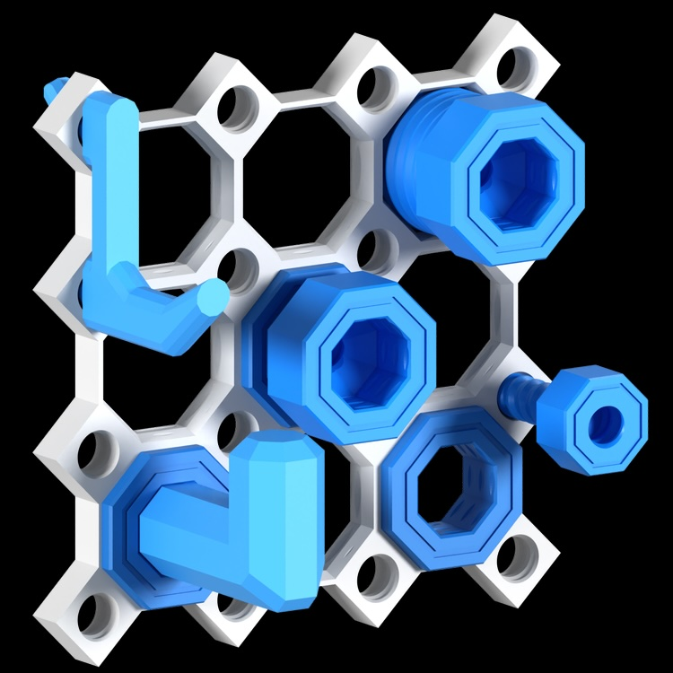

# multiboard

This is the UNOFFICIAL opensource Multiboard documentation repository.  People are encouraged to contribute to the documentation with project outlines, notes, tips, tricks, or parts documentation.  Feel free to fork and submit pull requests to update or expand the available docs.

### Resources:
* [Glossary](glossary.md) - Confused by all the different parts and terms?  The Glossary will help you figure things out
* [Tutorials](tutorials/) - Basic walkthroughs for building specific multiboard configurations.

### Multiboard home page:
* [multiboard.io](https://multiboard.io) - The official website and awesome work done by Jonathan (Keep Making).

### Videos:
* [Introduction to Multiboard](https://www.youtube.com/watch?v=sbbJ0pUYp8U) - The original video going over hte basics of Multiboard
* [Getting Started](https://www.youtube.com/watch?v=J5OF6diYiSE) - A good getting started video showing simple assemblies

### About
This repo and documentation are available as opensource and are not meant to replace or override the existing documentation on [multiboard.io](https://multiboard.io) but are instead set up as a resource for new builders to have a place to share ideas, and to provide an additional documentation source for aspiring makers.

Got questions?  Feel free to drop a mail to info@stonekeep.com
