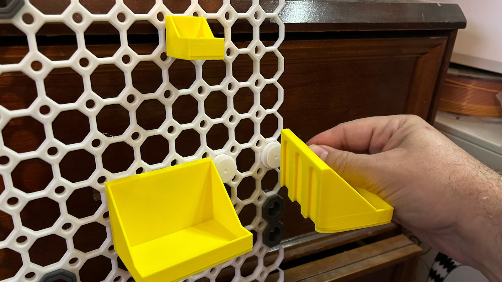
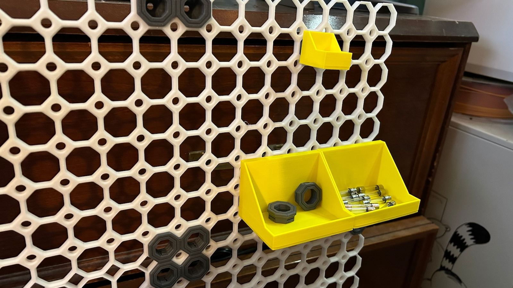

# Toolbins with Multiboard Connectors

This tutorial describes how to install hanging bins on your multiboard using multiboard connectors

##Parts list

* [core tile](https://than.gs/m/974214) (or an existing built set of tiles, see [the basic display tutorial](../basicdisplay/))
* [bins](https://www.printables.com/model/728933)
* [multiconnect connectors](https://www.printables.com/model/716558-multiconnect-general-connector-for-your-board)

## Steps
1. Print all the components
2. Choose a bin style you'd like to use, and print it out
3. Print  as many connectors as needed for the bin (count the slots on the back - you don't need one in every slot, but it does make it stronger)
4. Screw the multiconnect connector into your tile.  It just threads in
5. Hang your bin by sliding it over the connector.

## Pics

 

